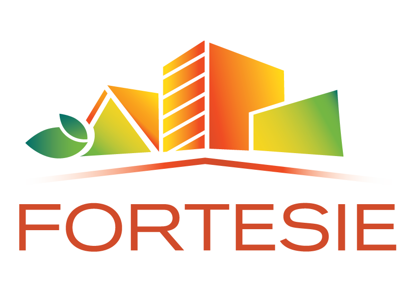

# H2020 FORTESIE
Version: 0.0.1

## Description 

The Data Model for all measurements generated across all pilot in the H2020 FORTESIE project (No 101080029).
The FORTESIE data models are based on the [SmartDataModels.org](https://smartdatamodels.org)

### Specification

<!-- Link to the [interactive specification](https://swagger.lab.fiware.org/?url=https://smart-data-models.github.io/dataModel.Energy/ACMeasurement/swagger.yaml) -->

Link to the [specification](./doc/spec.md)

### Examples

<!-- Link to the [example](./examples/example.json) (keyvalues) for NGSI v2 -->

<!-- Link to the [example](./examples/example.jsonld) (keyvalues) for NGSI-LD -->

<!-- Link to the [example](./examples/example-normalized.json) (normalized) for NGSI-V2 -->

Link to the [example](./examples/example-normalized.jsonld) (normalized) for NGSI-LD.

All measurement/entities that have a unit **MUST** include their unique [unitCode](https://docs.peppol.eu/poacc/billing/3.0/codelist/UNECERec20/)

## Demo

A simple demo is located on the demo folder. Please read the [README-demo.md](./demo/README-demo.md) for more information.